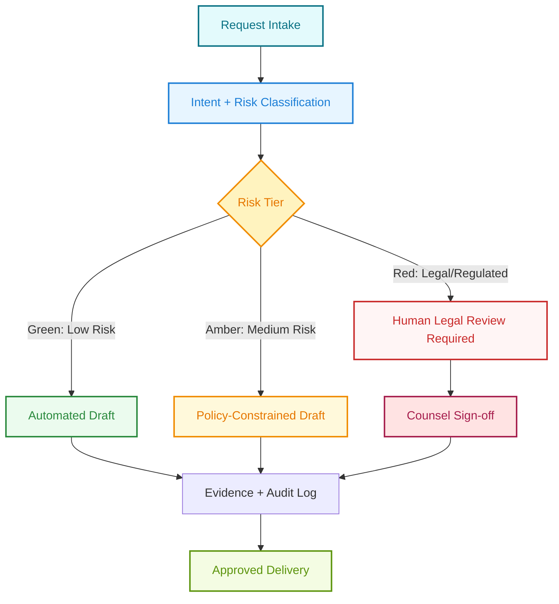

# JR


A professional operations and decision-support repository for JR, focused on execution quality, governance, traceability, and responsible use in legal-adjacent scenarios.

## Table of Contents

- [Executive Overview](#executive-overview)
- [Repository Layout](#repository-layout)
- [System Flow (Color-Coded)](#system-flow-color-coded)
- [Legal Scenario Proficiency](#legal-scenario-proficiency)
- [Operations Pack](#operations-pack)
- [Sales Pack](#sales-pack)
- [Runbook](#runbook)
- [Roadmap](#roadmap)
- [Contributing](#contributing)
- [License](#license)

## Executive Overview

JR is designed as a structured operator framework:

- Intake and classify requests.
- Route work through policy and risk gates.
- Execute with evidence capture.
- Escalate legal-sensitive outputs to qualified human review.

## Repository Layout

```text
JR/
  README.md
  LICENSE
  .gitignore
  docs/
    architecture/
      system-map.md
      execution-flow.md
    governance/
      legal-capability.md
      risk-tiering.md
  .github/
    workflows/
      ci.yml
```

## System Flow (Color-Coded)



## Legal Scenario Proficiency

Short answer: JR can be strong as a legal operations assistant, but it is not a law firm and should not be treated as fully autonomous legal counsel.

Capability model:

- Good at policy summarization, issue spotting, document structuring, and workflow automation.
- Good at consistency checks against known playbooks.
- Not sufficient alone for jurisdiction-specific legal conclusions, privileged strategy, or final legal advice.

See detailed model in [docs/governance/legal-capability.md](docs/governance/legal-capability.md).

## Operations Pack

- [Family Intake Playbook](docs/ops/family-intake-playbook.md)
- [Lead Priority Board](docs/ops/lead-priority-board.md)
- [DM Scripts](docs/templates/dm-scripts.md)
- [Intake Form](docs/templates/intake-form.md)
- [CRM Tracker CSV](docs/templates/crm-tracker.csv)

## Sales Pack

- [B2B Lawyer Offer Stack](docs/sales/b2b-lawyer-offer-stack.md)
- [Landing Page Copy](docs/sales/landing-page-copy.md)

## Runbook

1. Classify request risk tier.
2. Apply constraints and templates.
3. Generate draft with citations and assumptions.
4. Route all red-tier items to counsel review.
5. Archive final output and evidence trail.

## Roadmap

- Add policy engine checks in CI.
- Add structured legal request templates.
- Add reviewer approval workflow with required sign-offs.
- Add audit dashboard for compliance evidence.

## Contributing

Use PRs with clear scope, risk impact, and test evidence. See [docs/governance/risk-tiering.md](docs/governance/risk-tiering.md).

## License

MIT. See [LICENSE](LICENSE).
