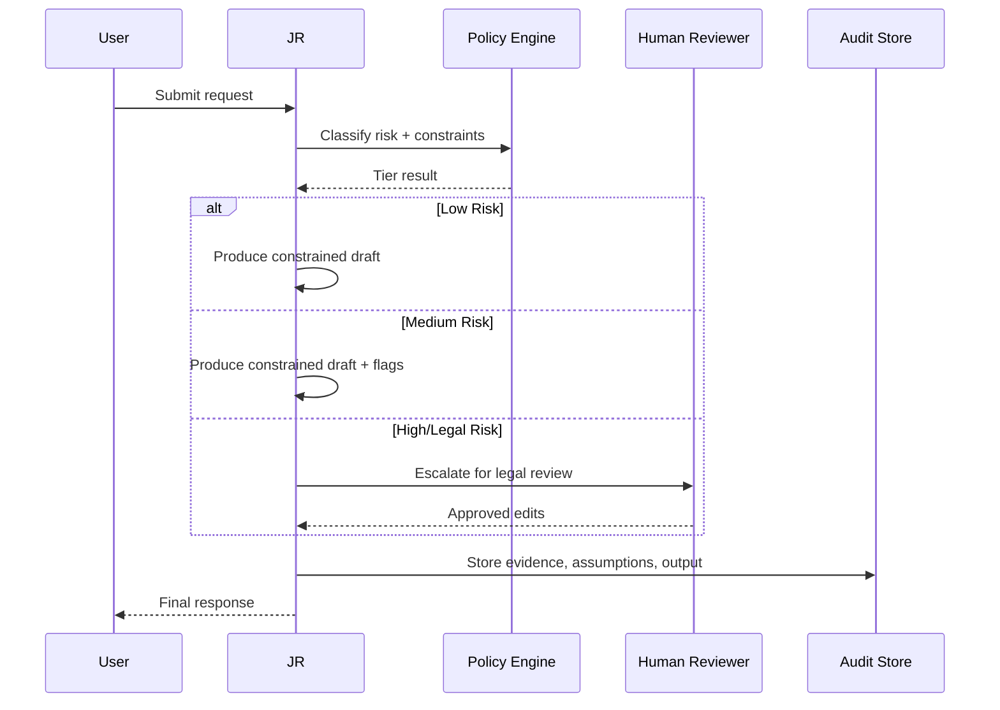

# Execution Flow

## End-to-End Flow

```mermaid
sequenceDiagram
    participant U as User
    participant J as JR
    participant P as Policy Engine
    participant H as Human Reviewer
    participant A as Audit Store

    U->>J: Submit request
    J->>P: Classify risk + constraints
    P-->>J: Tier result

    alt Low Risk
        J->>J: Produce constrained draft
    else Medium Risk
        J->>J: Produce constrained draft + flags
    else High/Legal Risk
        J->>H: Escalate for legal review
        H-->>J: Approved edits
    end

    J->>A: Store evidence, assumptions, output
    J-->>U: Final response
```
