# System Map

## Purpose

Define the complete JR operating architecture from intake through approved delivery.

## High-Level Components

- Intake Layer
- Classification Layer
- Policy and Risk Engine
- Drafting Engine
- Human Review Layer
- Audit and Evidence Store
- Delivery Layer

## Component Interaction

```mermaid
flowchart LR
    I[Intake API] --> C[Classifier]
    C --> P[Policy Engine]
    P --> D[Draft Engine]
    D --> R[Review Queue]
    R --> A[Audit Store]
    A --> O[Output Gateway]

    style I fill:#E3FAFC,stroke:#0B7285,stroke-width:2px
    style C fill:#E7F5FF,stroke:#1C7ED6,stroke-width:2px
    style P fill:#FFF9DB,stroke:#F08C00,stroke-width:2px
    style D fill:#EBFBEE,stroke:#2B8A3E,stroke-width:2px
    style R fill:#FFF5F5,stroke:#C92A2A,stroke-width:2px
    style A fill:#F8F0FC,stroke:#9C36B5,stroke-width:2px
    style O fill:#F4FCE3,stroke:#5C940D,stroke-width:2px
```

