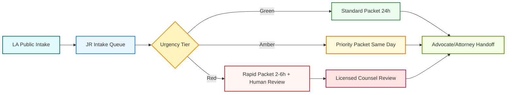

# LA Integration Blueprint

## Endpoint Status

- Public site: https://la.unykorn.org/
- Current status: live (HTTP 200)
- Hosting signal: Vercel

## What LA Already Does Well

- Strong family-crisis positioning and urgency language
- Clear disclaimer boundary: not a law firm, no legal advice
- Structured intake entrypoint at /intake
- Clear value narrative around timeline, evidence, and packetization
- Affordable access model with hardship option

## Strategic Role Split

### LA (Front Door)

- Public brand and trust surface
- Demand capture and free review intake
- Consumer education and urgency conversion
- Family-first messaging and hotline calls to action

### JR (Ops Brain)

- Triage scoring and case normalization
- Timeline and evidence index generation
- Missing-document detection
- Packet build for advocate and attorney handoff
- Red-tier escalation governance and audit quality gates

## Operational Flow

## Immediate Integration Checklist

1. Mirror LA intake fields into JR intake form schema.
2. Define routing contract: LA submission ID -> JR lead ID.
3. Configure first-response SLA by tier.
4. Enable red-tier mandatory human legal review before final output.
5. Add packet completion status back to LA client-facing status page.

## Data Contract (Minimum)

- lead_source: la.unykorn.org
- lead_external_id: LA form submission id
- person_name
- contact_email
- contact_phone
- state
- county
- case_type
- narrative_raw
- deadlines_raw
- urgency_precheck
- consent_acknowledged

## Suggested KPIs

- Time to first response
- Intake to packet completion time
- Red-tier counsel review rate
- Intake to retained counsel conversion rate
- Family satisfaction score after first packet delivery

## Risk Controls

- No definitive legal advice in JR-generated outputs
- Automatic disclaimer insertion on all outbound packet summaries
- Counsel sign-off required for red-tier release
- Full source traceability for every factual claim
